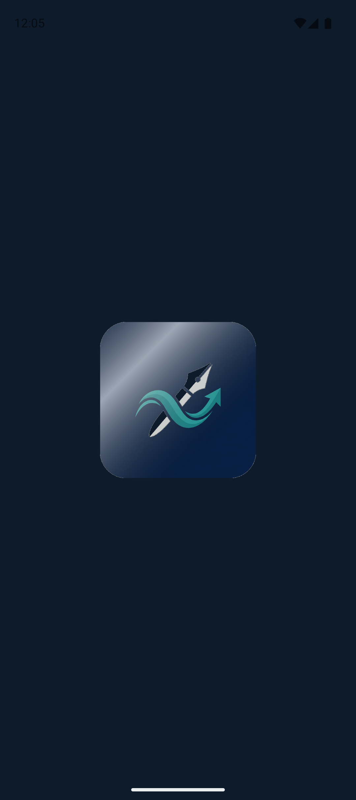
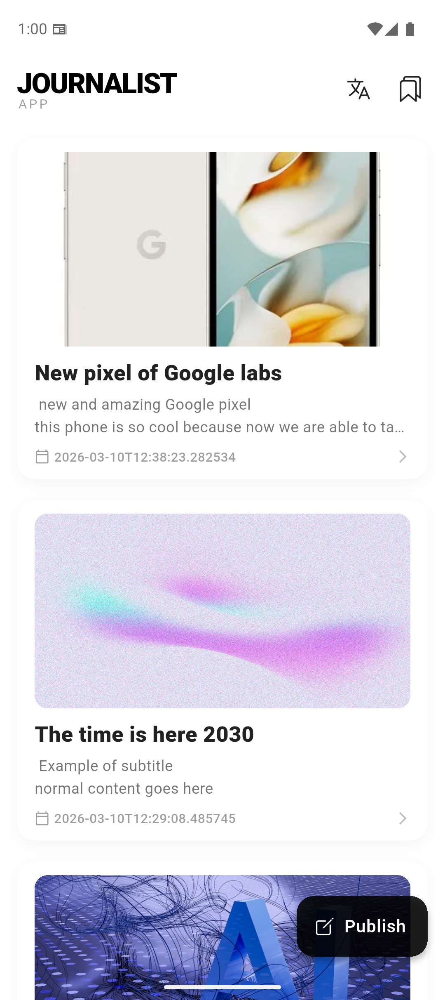
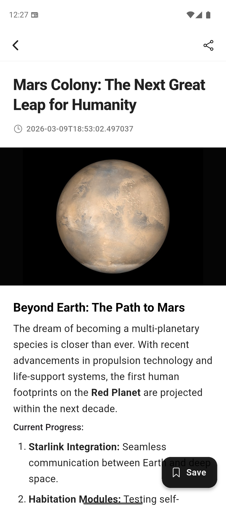
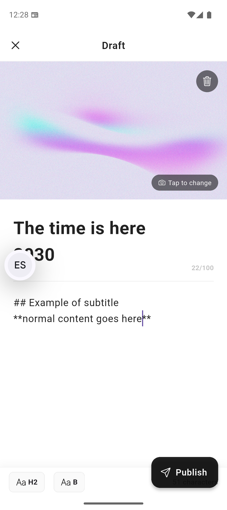
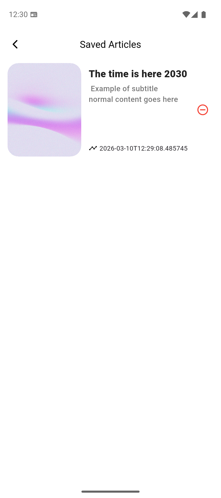
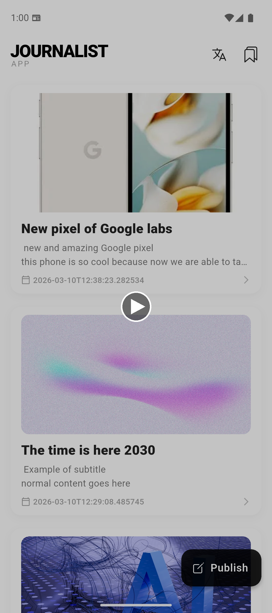
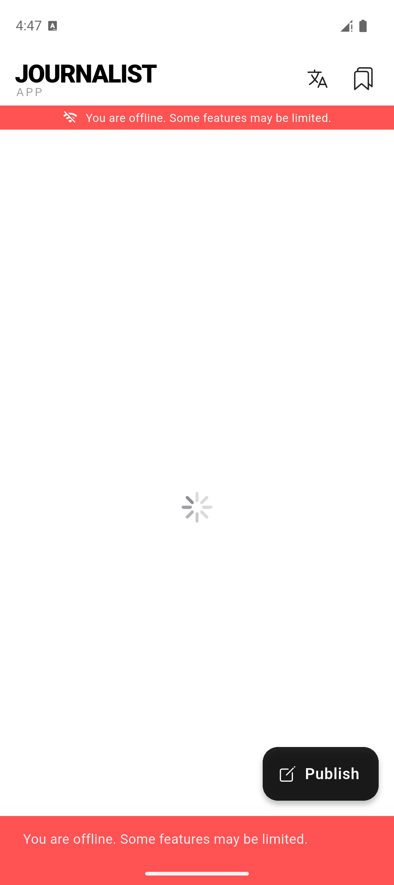
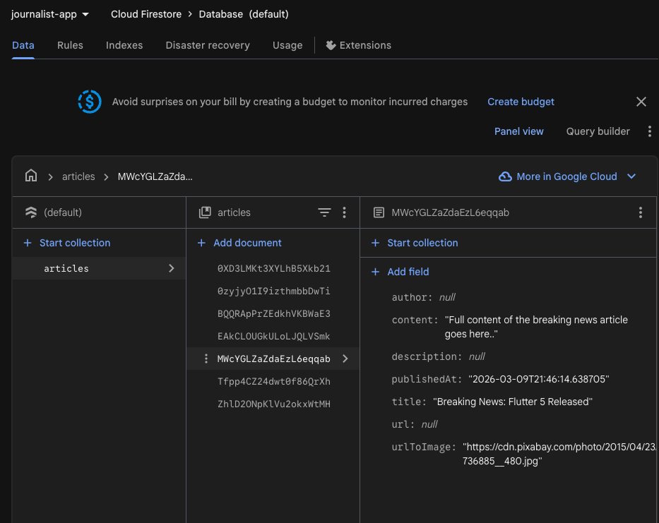

# Project Report: Journalist App

### 1. Introduction
When I started this project, I was really excited. I already knew Flutter and felt comfortable with it, but building a dedicated app for journalists with clean architecture and real-world tools seemed like a fun challenge. My goal was to build something robust, clean, and easy to scale.

### 2. Learning Journey
Even though I was already familiar with Flutter, this project taught me a lot about project setup and backend integration. The coolest part for me was being able to create a database schema so easily using the Firebase CLI. It felt like magic setting up the backend structure in just a few commands instead of spending hours configuring a custom server. I relied mostly on the official Firebase documentation and Flutter guides to get everything working smoothly. Additionally, I really wanted to ensure I was following the best practices of Flutter, so I worked with LLMs and utilized the [dash_skills](https://github.com/kevmoo/dash_skills) repository to guide my architectural choices and code quality throughout the development process.

### 3. Challenges Faced
One of the main challenges was making sure the app worked smoothly offline and online. Handling the local database alongside the remote Firebase data required careful state management. Also, correctly formatting the article texts so they look great was tricky at first. I tackled this by integrating Markdown support, which made rendering the text much simpler and cleaner.

### 4. Reflection and Future Directions
Overall, working on this app was a fantastic experience. It really helped me solidify my understanding of Clean Architecture and Bloc/Cubit state management in Flutter. For future directions, I’d love to add features like a personalized dark mode, push notifications for breaking news, and maybe a collaborative editing feature so multiple journalists can work on a draft together.

### 5. Proof of the project
| Splash Screen | News Feed | Article Detail |
| :---: | :---: | :---: |
|  |  |  |

| Publish Article | Saved Articles |
| :---: | :---: |
|  |  |

#### Video Prototype
You can view a full demonstration of the app's features, including the animated splash screen, localization switching, and article publishing in the video below:

[](assets/app_demo.mp4)

*(Note: Click the image above or open `docs/assets/app_demo.mp4` directly to watch the demo)*

#### Offline Draft Publishing Video
You can watch the draft publication, saving as draft, and auto-syncing feature when connection is established:

[](assets/draft_feature.webm)

*(Note: Click the image above or open `docs/assets/draft_feature.webm` directly to watch the demo)*

#### AI Article Summary Video
You can watch the integrated AI model generating a high-quality summary via the Hugging Face Inference API:

[](assets/huggingface_summary.webm)

*(Note: Click the image above or open `docs/assets/huggingface_summary.webm` directly to watch the demo)*

#### Firebase Database Structure
Here is a view of our Firestore database syncing in real-time:



### 6. Overdelivery

**1. New Features Implemented:**
- **Shared Article:** I added native sharing functionality so users can easily share article titles and links via their phone's native share sheet.
- **Language Support (i18n):** Implemented full English and Spanish localization using `flutter_localizations` and ARB files. Users can toggle the language seamlessly from the app bar.
- **Feedback for Offline Sync:** Built visual feedback for users so they know when they are reading offline saved articles or when the app is actively syncing data from the cloud.
- **Offline Article Drafting and Auto-Sync:** Implemented a system that detects when the device is offline during article publishing, saves the article securely as a local draft (complete with cached images and a Draft UI badge), and automatically synchronizes and pushes it to Firebase as soon as the internet connection is restored.
- **Markdown Formatting:** Added a rich text renderer using Markdown so that the articles are beautifully formatted with bold text, lists, and proper headers.
- **Premium Aesthetics:** Added a visually appealing splash screen with a dynamic shine animation and integrated haptic feedback native to the OS. Also created custom transparent app launcher icons for both Android and iOS.
- **AI Article Summarization:** Integrated the Hugging Face Inference API using the `facebook/bart-large-cnn` model. This specific model was chosen because it is a state-of-the-art transformer fine-tuned specifically on CNN and Daily Mail news articles, making it exceptionally good at generating concise, abstractive text summaries for journalism. 
- **Unit Testing:** Implemented core tests for domain usecases (`GetArticleUseCase`, `SaveArticleUseCase`, `PublishArticleUseCase`) utilizing the `mocktail` package for mocking dependencies, solidifying app stability.

**2. Prototypes Created:**
- **Offline Draft & Auto-Sync Flow:**
  ```mermaid
  graph TD
      A[Publish Article] --> B{Network Connected?}
      B -- Yes --> C[FirebaseArticleService]
      B -- No --> D[Save to AppDatabase as DRAFT_ARTICLE]
      D --> E[Wait for Connection]
      E -. NetworkCubit detects connection .-> F[LocalArticleCubit Sync]
      F --> G[Upload DRAFT_ARTICLE to Firebase]
      G --> H[Remove Local Draft]
      H --> I[Refresh DailyNews Feed]
      C --> I
  ```
- **Firestore `articles` Collection Schema:**
  ```mermaid
  erDiagram
      ARTICLES {
          string author
          string title
          string description
          string url
          string urlToImage
          string publishedAt
          string content
      }
  ```

**3. How Can You Improve This:**
- **Search Component:** Adding a search feature to find articles by typing in keywords.
- **Dark Mode:** Adding a system-aware dark mode would make the reading experience much better at night.
- **Cloud Syncing Settings:** We could sync user preferences (like their chosen language and saved articles) to their Firebase account so they can log in on multiple devices.
- **Push Notifications:** Alerting users to breaking news or successful article publications using Firebase Cloud Messaging.


### 7. Extra Sections
Thank you for reading my report! Building this app was a great journey.
